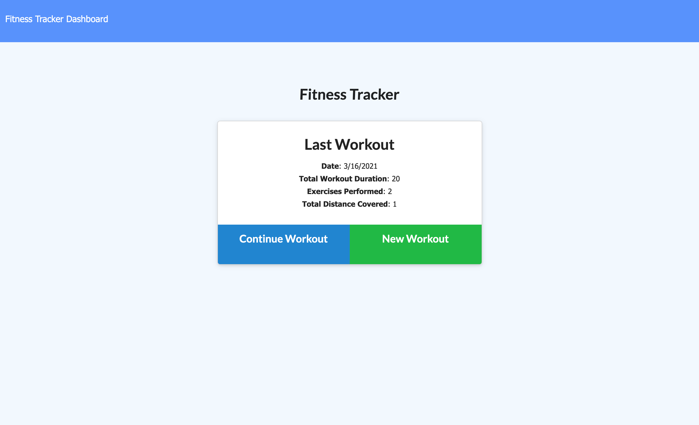
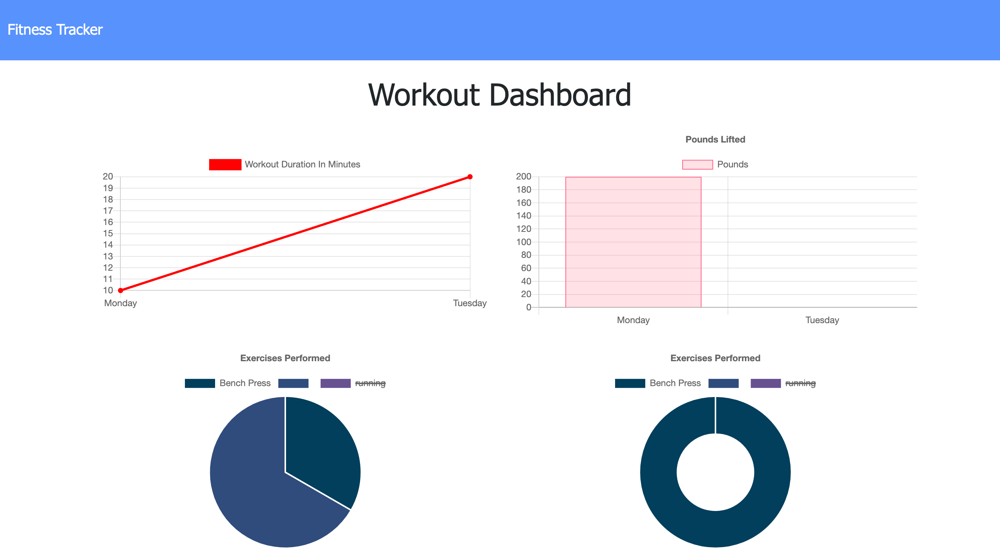

# Fitness App

  ## Description

  An heroku web app to track your workouts. The app will allow you to enter type of exercise and number of reps or distance. The dashboard will then show your progress over time in a graphic interface.

  [Launch 🚀](https://ray-luna-fitness-tracker.herokuapp.com/) 

  ## Table of Contents

  * [Image](#image)
  * [Technologies](#technologies)
  * [Known-Bugs](#known-bugs)
  * [Next-Steps](#next-steps)
  * [License](#license)
  * [Contact](#contact)
  * [Links](#links)

  ## Image

  
  

  ## Technologies
  
  * HTML
  * CSS
  * Javascript
  * Node

  ## Known-Bugs

  There appears to be a bug in loading the dashboard on the current heroku deployment.

  ## Next-Steps

  Work out the bug with the dashboard. Add more options for exercises.

  ## License

  This project is licensed under the [MIT](https://opensource.org/licenses/MIT) license.
  

  ## Contact

  Author: Ray Luna 

  If you have any questions about the repo, open an issue or contact me directly at:
  - E-Mail: leon.luna.ray@gmail.com
  - GitHub: [leon-luna-ray](https://github.com/leon-luna-ray)

  ## Links

  - [Deployed Project](https://ray-luna-fitness-tracker.herokuapp.com/) 

  - [Project Repository](https://github.com/leon-luna-ray/fitness-app)

  